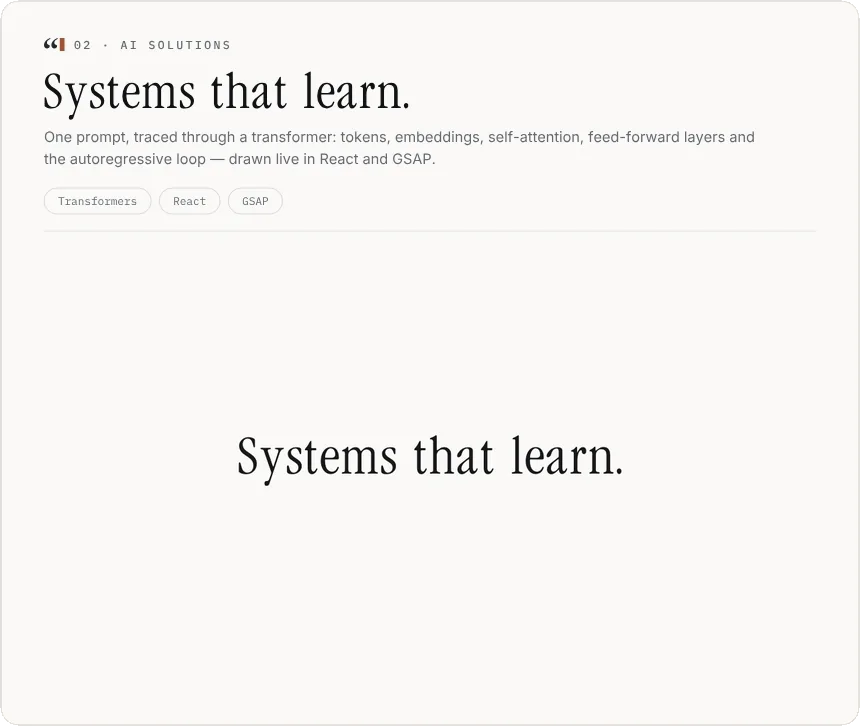
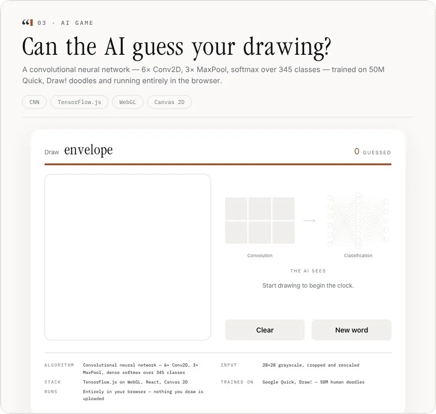
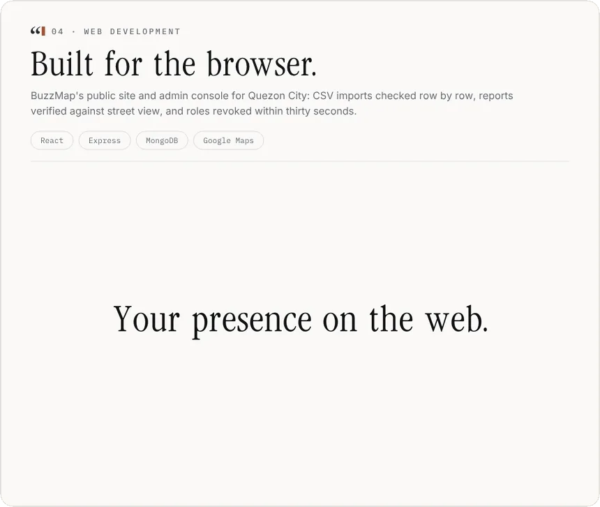
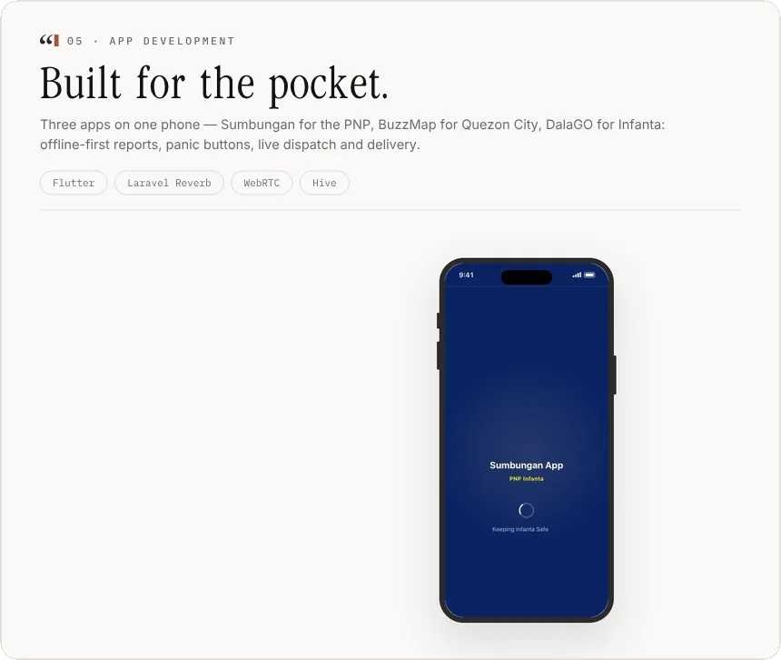
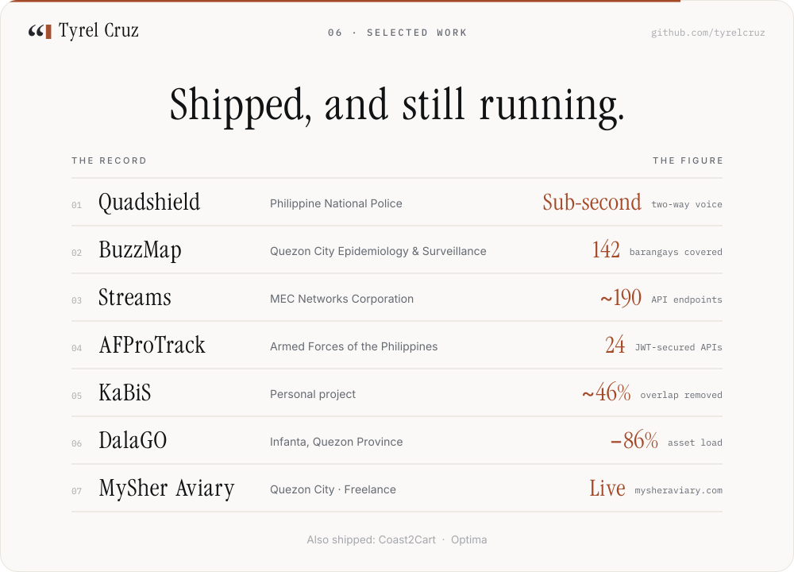

<!-- Pages: assets/build.py · Recordings of the portfolio: assets/showcase/make.sh -->

  
  
  

<b>The record, in one line each</b>

 

| | Project | What it is |
| :-- | :-- | :-- |
| 01 | [**Quadshield**](https://pnpinfanta.com/) | Emergency dispatch for the PNP — Reverb signalling, LiveKit WebRTC voice, an ESP32 panic button and an offline-first Flutter app. |
| 02 | [**BuzzMap**](https://www.buzzmap-qcesd.com/home) | Crowdsourced dengue prevention for Quezon City — 380+ users, 142 barangays, Google GenAI recommendations. |
| 03 | **Streams** | Field-service dispatch on Laravel 12, React 19 and Flutter — ~190 endpoints, 12 roles, five enterprise systems synced. |
| 04 | **AFProTrack** | Trainee management for the Philippine Army — Flutter on 24 JWT APIs, React 19 console with 44-permission RBAC. |
| 05 | [**KaBiS**](https://kabis-review.vercel.app/) | Board-exam review — LLM ingestion behind server-side validation, ~46% overlap deduplicated. |
| 06 | **DalaGO** | Food delivery for Infanta on Laravel 12 and Flutter — device-aware caching took a 9.25MB load to 1.27MB. |
| 07 | [**MySher Aviary**](https://mysheraviary.com/) | Bird marketplace and management on React, Express.js, Supabase and PostgreSQL. |

  
  

  
  
  

