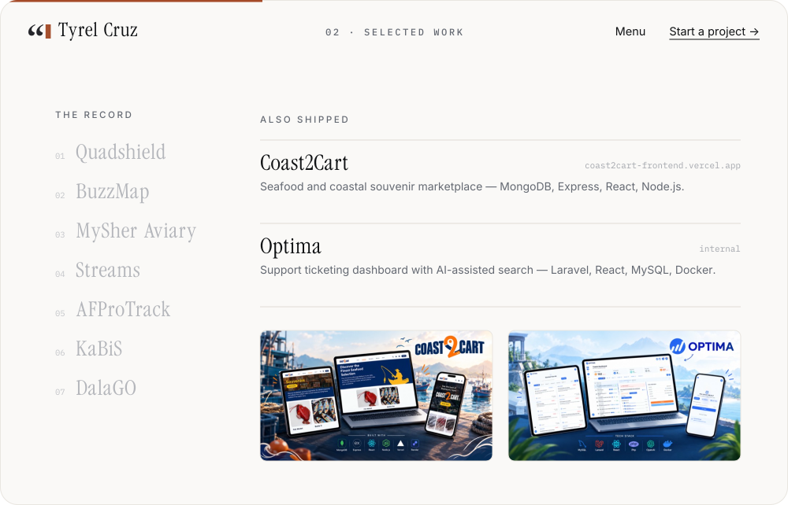
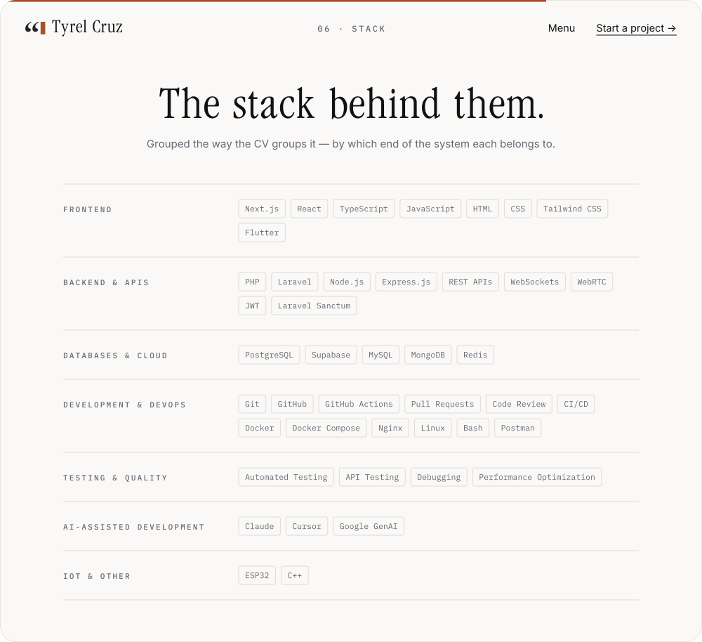

<!-- Pages are generated by assets/build.py in the portfolio's design (devtyrelcruz.vercel.app).
     Edit the content there, then run: python3 assets/build.py -->

  
  
  
  

  
  
  
  
   
  
  
  
  

<a href="https://devtyrelcruz.vercel.app/#app-development"></a>

<a href="https://pnpinfanta.com/"></a>

<b>Quadshield</b>: case study

 

**Problem:** Citizens needed a fast way to reach police dispatch, even with weak signal or no phone at hand.

- **Real-time emergency dispatch:** Laravel Reverb WebSockets handle call signalling and a **LiveKit WebRTC SFU** carries the audio, giving **sub-second two-way voice** between citizens and dispatchers on mobile and web.
- **ESP32 IoT panic button (C++):** replaced hardcoded secrets with a **WiFiManager captive-portal** setup and **NVS flash persistence**, so any number of devices can be onboarded without a code change.
- **Offline-first Flutter app:** a **Hive-backed local transaction queue** lets citizens file reports with photo and video evidence in low-connectivity areas without losing data.
- Automated testing and debugging workflows to keep releases reliable.

<a href="https://www.buzzmap-qcesd.com/home"></a>

<b>BuzzMap</b>: case study

 

**Problem:** Quezon City's Epidemiology and Surveillance Division wanted to get ahead of dengue, not just record it.

- Built the cross-platform **Flutter** app and co-built the **React + Tailwind** web platform, handling real-time reports from **380+ active users across 142 barangays**.
- **AI-driven prescriptive recommendations** with Google GenAI and **geospatial risk scoring**: location-specific prevention advice for citizens, and high-risk zones put first for administrators.
- Worked directly with the division on **statistical early-outbreak detection** fed by crowdsourced reports.

<a href="https://mysheraviary.com/"></a>

<b>MySher Aviary</b>: case study

 

- Full-stack app on **React, Express.js, Supabase and PostgreSQL**: customer-facing features, REST APIs, backend services and database workflows.
- Git/GitHub flow with feature branches and pull requests for code review.
- Used **Claude and Cursor** for AI-assisted development, and reviewed, debugged, tested and validated the generated code by hand.



<b>Streams</b>: case study

 

**Problem:** One field-service platform had to cover dispatch, GPS tracking, service reports, client sign-off and billing for **3 clients, 12 role types and ~190 API endpoints**.

- **Real-time collaborative reporting** (Laravel Reverb): multi-user editing, **per-field conflict detection**, approval workflows, revision snapshots and secure client acknowledgment.
- **5 external enterprise systems** integrated through queued sync with retries, caching, reconciliation, overlap protection and **idempotent recovery from partial failures**.
- **Layered security:** JWT in HttpOnly cookies, passwordless OTP, granular RBAC, rate limiting, signed URLs, access revocation and **append-only audit logs**.
- **Trunk-based CI/CD:** 5 GitHub Actions workflows, automated backend, web and mobile tests and builds, protected branches, and Docker deploys through a self-hosted runner to a **9-service production stack**.
- **Scale work:** Redis for caching, sessions and queues; **39 database indexes**; server-side geocoding; lazy-loaded routes; and a **Philippine labour-compliant man-hour cost engine** for overtime, night differential, holidays and rest days.



<b>AFProTrack</b>: case study

 

- Cross-platform **Flutter trainee app** for the Philippine Army's Training and Doctrine Command: 11 screens, 21 reusable modules and **24 JWT-authenticated REST APIs** on Node.js and MongoDB.
- **Role-gated onboarding:** cascading organisational selection, AFP Service ID and mobile validation, email verification and admin approval.
- Enrollment, scheduling and personnel dashboards with automatic **completion, combat-readiness and career-progression** calculations, including current-to-next-rank tracking.
- **Certificate uploads** (image or PDF) from camera or gallery via multipart requests and Cloudinary, with in-memory caching and **dirty-flag invalidation** to cut redundant API calls.
- Contributed to the **React 19 + Redux Toolkit admin console** (89 endpoints, 44-permission RBAC), including a fix for a **duplicate-account bug caused by stale closure state**.

<a href="https://kabis-review.vercel.app/"></a>

<b>KaBiS</b>: case study

 

- **Exam-generation engine** that builds mock exams to the official Tables of Specifications, topic quotas and difficulty targets, and reports when the question pool cannot meet the blueprint.
- **AI-assisted ingestion pipeline:** a reusable LLM extraction contract whose every output passes a **server-side validation layer** before use.
- **SHA-256 canonical-concept deduplication** that removed **~46% cross-source overlap**.
- **Question variants re-randomised on every attempt**, so memorised answers carry no value, graded by a **fuzzy free-recall engine** (Levenshtein, bounded containment, name normalisation) that will not accept the opposite of a near-identical answer.
- Found **110 per-row database queries** behind a multi-second request and replaced them with **one batched write**.



<b>DalaGO</b>: case study

 

- Full-stack delivery platform for **customers, riders and merchants**: a domain-driven Laravel 12 backend and a feature-based Flutter app.
- Built the whole **customer mobile app**: authentication, restaurant discovery, product comparison, cart, checkout and order management on Laravel REST and Sanctum.
- **Device-aware image caching and asset preloading** shrank a 9.25MB asset to **1.27MB (~86% lighter)** on image-heavy screens.

<a href="https://coast2cart-frontend.vercel.app/"></a>

<a href="https://devtyrelcruz.vercel.app/#app-development"></a>



<a href="mailto:tyrelcruz90@gmail.com?subject=Interview%20invitation"></a>

<b>01 &nbsp;Tell me about yourself.</b>

 

- **Now:** Full-Stack Software Engineer at MEC Networks Corporation, and co-founder and lead engineer at QuadSync Technologies.
- **Trained:** BS Information Technology (Mobile and Web Applications) at National University Manila. Magna Cum Laude, GWA 3.78.
- **The work:** Field-service dispatch for MEC's clients, emergency dispatch for the PNP, trainee management for the Philippine Army, dengue surveillance for Quezon City. Laravel, Node.js and React with TypeScript on the web, Flutter on mobile, Docker underneath.
- **In short:** I am happiest owning a system end to end — database to deploy pipeline, and now and then the circuit board.

<b>02 &nbsp;What's the hardest thing you've built?</b>

 

- **Situation:** The Philippine National Police needed citizens to reach a dispatcher instantly — from a phone, from the web and from a physical panic button.
- **Task:** Build Quadshield, the reporting and dispatch platform across all three.
- **Action:** Laravel Reverb WebSockets for call signalling, a LiveKit WebRTC SFU for the audio, an offline-first Flutter app, and C++ firmware for an ESP32 panic button.
- **Result:** Sub-second, two-way voice between citizens and dispatchers, on mobile and web.

<b>03 &nbsp;Tell me about a process you improved.</b>

 

- **Situation:** At MEC Networks Corporation, three codebases — a Laravel back end, a React front end and a mobile app — were shipped with a lot of manual steps.
- **Task:** Make releases repeatable, so shipping stopped being an event.
- **Action:** Designed and automated CI/CD pipelines for all three with GitHub Actions and Docker Compose.
- **Result:** **−70% manual effort, −90% build failures, deploys from 10 to 4 minutes.**

<b>04 &nbsp;Describe a performance problem you solved.</b>

 

- **Situation:** DalaGO's customer app is image-heavy — restaurants, menus, product comparisons — and it has to feel quick on whatever phone a customer owns.
- **Task:** Cut the weight of the image-heavy screens.
- **Action:** Device-aware image caching and asset preloading, so each phone gets images suited to it, before it needs them.
- **Result:** The heaviest asset load went from **9.25MB to 1.27MB (~86% lighter)**.

<b>05 &nbsp;Tell me about building under real-world constraints.</b>

 

- **Situation:** Emergency reports come from exactly the places where signal is worst, and Quadshield panic buttons had to be deployable as a fleet.
- **Task:** Make both work without a developer standing next to them.
- **Action:** Replaced the hardcoded Wi-Fi secrets in the ESP32 firmware with a WiFiManager captive portal and NVS flash storage. Gave the Flutter app a Hive-backed queue that holds reports, photos and video included, until there is a connection.
- **Result:** New hardware onboards without a code change, and reports filed in low-signal areas are not lost.

<b>06 &nbsp;How do you work with non-technical stakeholders?</b>

 

- **Situation:** Quezon City's Epidemiology and Surveillance Division wanted to get ahead of dengue, not just record it.
- **Task:** Turn community reports into something epidemiologists could act on.
- **Action:** Worked with the division to design prescriptive analytics on statistical methods, added geospatial risk scoring, and used Google GenAI to give citizens location-specific prevention advice.
- **Result:** BuzzMap: live community reporting across the city, **380+ active users in 142 barangays**, with high-risk zones put first for administrators.

<b>07 &nbsp;Why should we hire you?</b>

 

- **I ship:** Seven platforms on my CV, three of them for government, while finishing a Magna Cum Laude degree.
- **I measure:** When I touch a process it gets a number: 70% less manual deployment, 90% fewer failed builds, 40% fewer duplicate reports, 110 queries collapsed into one batched write, an app 86% lighter.
- **I cover the stack:** Laravel, Node.js, React 19, TypeScript, Flutter, Docker, WebRTC — and C++ on a microcontroller when the job calls for it. Fewer handoffs, fewer things waiting on someone else.
- **I flag gaps:** The screening on my [portfolio](https://devtyrelcruz.vercel.app/#interview) shows what I have not done as plainly as what I have. You would get the same in stand-ups.

<b>08 &nbsp;Do you have any questions for us?</b>

 

- What does a great first ninety days look like in this role?
- How does code get from a laptop to production on your team today?
- What is the one system your team would rebuild if it had the time?
- And: when can we talk? [tyrelcruz90@gmail.com](mailto:tyrelcruz90@gmail.com)



  
  

  
  
  

  

