<!-- Visuals are generated by assets/build.py. Edit the content there, then run: python3 assets/build.py -->

<a href="https://tyrelcruz.com"></a>

  <a href="https://tyrelcruz.com"><picture><source media="(prefers-color-scheme: dark)" srcset="./assets/btn-portfolio-dark.svg" /></picture></a>&nbsp;
  <a href="https://linkedin.com/in/tyrelcruz"><picture><source media="(prefers-color-scheme: dark)" srcset="./assets/btn-linkedin-dark.svg" /></picture></a>&nbsp;
  <a href="mailto:tyrelcruz90@gmail.com"><picture><source media="(prefers-color-scheme: dark)" srcset="./assets/btn-email-dark.svg" /></picture></a>

  <a href="#overview"><picture><source media="(prefers-color-scheme: dark)" srcset="./assets/nav-overview-dark.svg" /></picture></a>
  <a href="#highlights"><picture><source media="(prefers-color-scheme: dark)" srcset="./assets/nav-highlights-dark.svg" /></picture></a>
  <a href="#experience"><picture><source media="(prefers-color-scheme: dark)" srcset="./assets/nav-experience-dark.svg" /></picture></a>
  <a href="#work"><picture><source media="(prefers-color-scheme: dark)" srcset="./assets/nav-work-dark.svg" /></picture></a>
  <a href="#ask-me"><picture><source media="(prefers-color-scheme: dark)" srcset="./assets/nav-ask-me-dark.svg" /></picture></a>
  <a href="#toolkit"><picture><source media="(prefers-color-scheme: dark)" srcset="./assets/nav-toolkit-dark.svg" />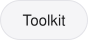</picture></a>

 

<picture><source media="(prefers-color-scheme: dark)" srcset="./assets/h-overview-dark.svg" /></picture>


  

<picture><source media="(prefers-color-scheme: dark)" srcset="./assets/h-highlights-dark.svg" /></picture>

<picture><source media="(prefers-color-scheme: dark)" srcset="./assets/highlights-dark.svg" />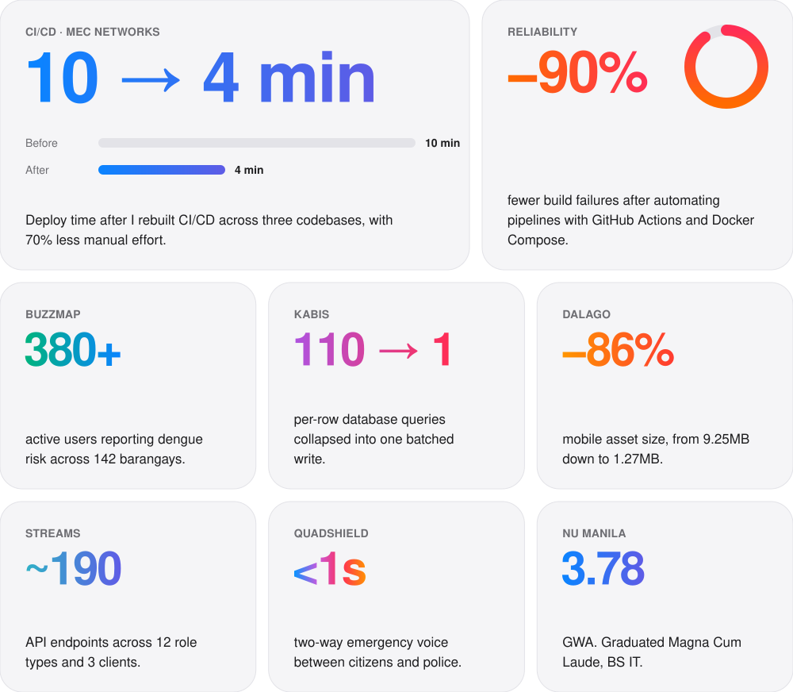</picture>

  

<picture><source media="(prefers-color-scheme: dark)" srcset="./assets/h-experience-dark.svg" /></picture>

<picture><source media="(prefers-color-scheme: dark)" srcset="./assets/experience-dark.svg" />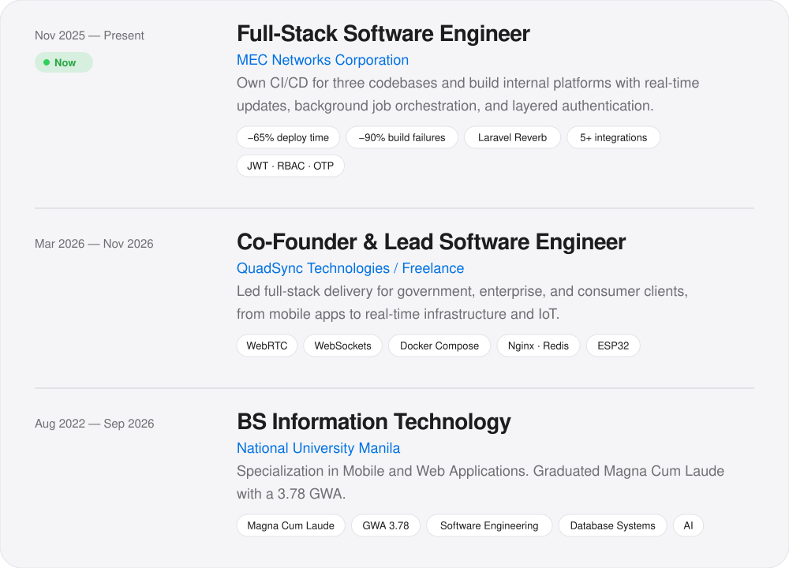</picture>

<b>MEC Networks Corporation</b>: full details

 

- Designed and automated **CI/CD pipelines across three codebases** (Laravel backend, React frontend, mobile app) using GitHub Actions and Docker Compose. Cut manual deployment effort by **70%**, build failures by **90%**, and deployment time by **65% (10 → 4 min)**.
- Built a **workforce operations management platform** (Laravel/React) with real-time WebSocket updates via self-hosted **Laravel Reverb** and **multi-queue background jobs** across 5+ third-party integrations (HR sync, geocoding, billing). Duplicate issue reports dropped by **40%**.
- Developed internal applications on Laravel, React, MySQL, and REST APIs with **JWT authentication, role-based access control, and OTP multi-factor authentication**.

<b>QuadSync Technologies / Freelance</b>: full details

 

- Architected and delivered full-stack platforms for **government, enterprise, and consumer** clients: mobile apps, web systems, backends, and real-time communication built on Laravel, React, Flutter, WebSockets, WebRTC, Docker, and IoT.
- Implemented production infrastructure with **Docker Compose, Nginx, PHP-FPM, Redis, MySQL, Laravel queue workers, and WebSocket services** on scalable VPS deployments.

<b>National University Manila</b>: full details

 

- BS Information Technology, Specialization in Mobile and Web Applications
- **Magna Cum Laude**, GWA **3.78**
- Relevant coursework: Software Engineering, Operating Systems, Database Systems, Artificial Intelligence

 

<picture><source media="(prefers-color-scheme: dark)" srcset="./assets/h-work-dark.svg" />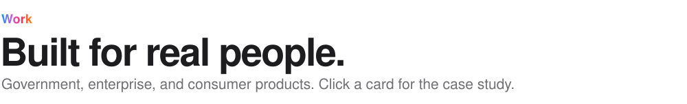</picture>

<a href="#cs-quadshield"><picture><source media="(prefers-color-scheme: dark)" srcset="./assets/project-quadshield-dark.svg" />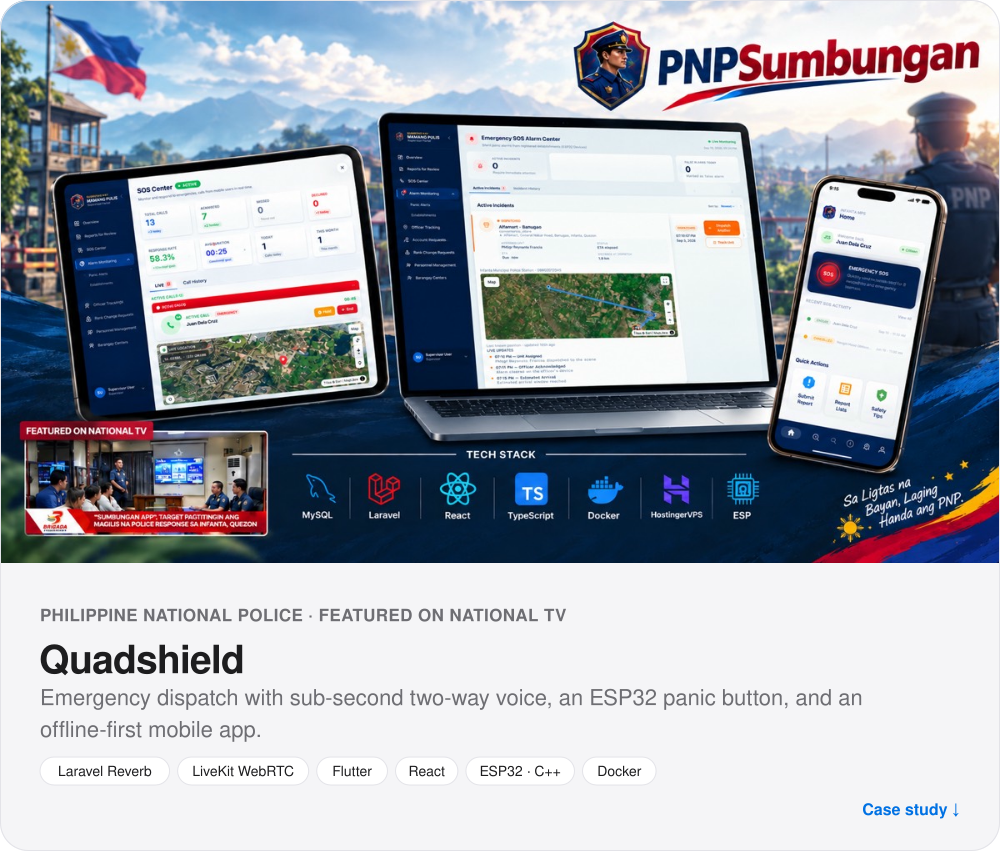</picture></a>

  <a href="#cs-streams"><picture><source media="(prefers-color-scheme: dark)" srcset="./assets/project-streams-dark.svg" />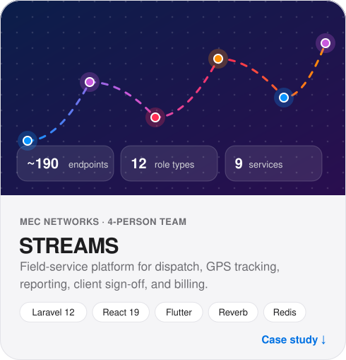</picture></a>
  <a href="#cs-buzzmap"><picture><source media="(prefers-color-scheme: dark)" srcset="./assets/project-buzzmap-dark.svg" />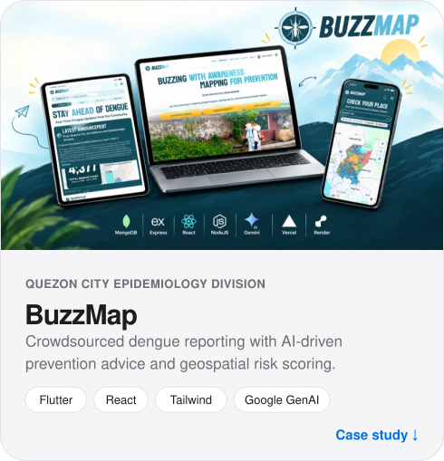</picture></a>

  <a href="#cs-afprotrack"><picture><source media="(prefers-color-scheme: dark)" srcset="./assets/project-afprotrack-dark.svg" />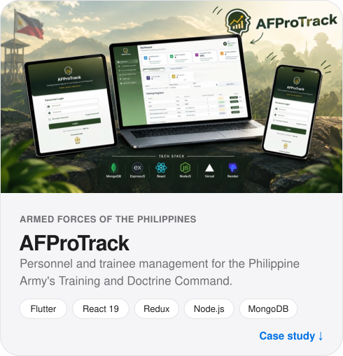</picture></a>
  <a href="#cs-kabis"><picture><source media="(prefers-color-scheme: dark)" srcset="./assets/project-kabis-dark.svg" />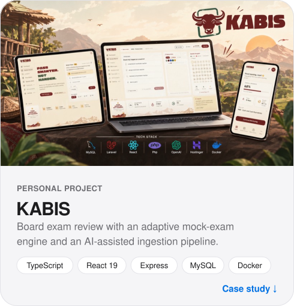</picture></a>

  <a href="#cs-dalago"><picture><source media="(prefers-color-scheme: dark)" srcset="./assets/project-dalago-dark.svg" />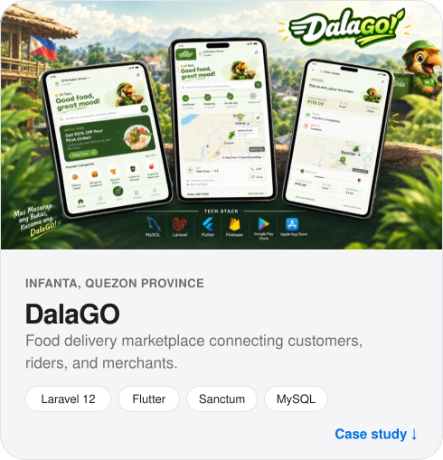</picture></a>
  <a href="#cs-mysheraviary"><picture><source media="(prefers-color-scheme: dark)" srcset="./assets/project-mysheraviary-dark.svg" />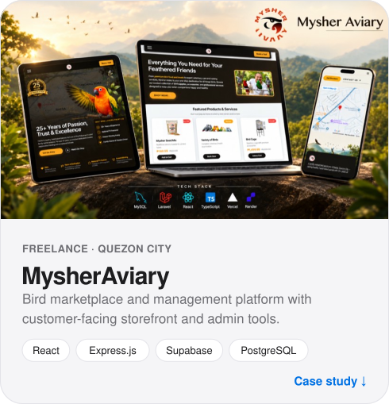</picture></a>

  <picture><source media="(prefers-color-scheme: dark)" srcset="./assets/project-coast2cart-dark.svg" />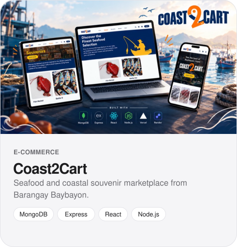</picture>
  <picture><source media="(prefers-color-scheme: dark)" srcset="./assets/project-optima-dark.svg" />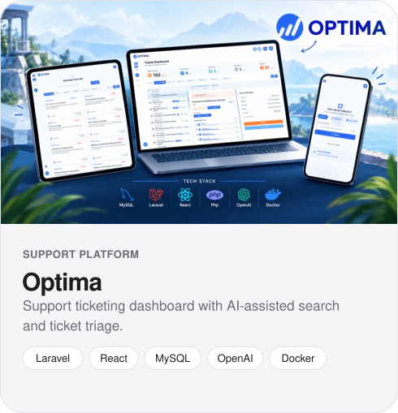</picture>

<b>Quadshield</b>: case study

 

**Problem:** Citizens needed a fast way to reach police dispatch, even with weak signal or no phone at hand.

- **Real-time emergency dispatch:** Laravel Reverb WebSockets handle call signaling and a **LiveKit WebRTC SFU** carries audio, giving **sub-second two-way voice** between citizens and dispatchers on mobile and web.
- **ESP32 IoT panic button (C++):** replaced hardcoded secrets with a **WiFiManager captive-portal** setup and **NVS flash persistence**, so any number of devices can be onboarded without a code change.
- **Offline-first Flutter app:** a **Hive-backed local transaction queue** lets citizens file reports with photo/video evidence in low-connectivity areas without losing data.
- Automated testing and debugging workflows to keep releases reliable.

<b>STREAMS</b>: case study

 

**Problem:** One field-service platform had to cover dispatch, GPS tracking, service reports, client sign-off, and billing for **3 clients, 12 role types, and ~190 API endpoints**.

- **Real-time collaborative reporting** (Laravel Reverb): multi-user editing, **per-field conflict detection**, approval workflows, revision snapshots, and secure client acknowledgment.
- **5 external enterprise systems** integrated through queued sync with retries, caching, reconciliation, overlap protection, and **idempotent recovery from partial failures**.
- **Layered security:** JWT in HttpOnly cookies, passwordless OTP, granular RBAC, rate limiting, signed URLs, access revocation, and **append-only audit logs**.
- **Trunk-based CI/CD:** 5 GitHub Actions workflows, automated backend/web/mobile tests and builds, protected branches, and Docker deploys through a self-hosted runner to a **9-service production stack**.
- **Scale work:** Redis for caching, sessions, and queues; **39 database indexes**; server-side geocoding; lazy-loaded routes. Also built a **Philippine labor-compliant man-hour cost engine** covering overtime, night differential, holidays, and rest days.

<b>BuzzMap</b>: case study

 

**Problem:** Quezon City's Epidemiology and Surveillance Division needed community-level dengue reports and a way to decide where to step in first.

- Built the cross-platform **Flutter** app and co-built the **React + Tailwind** web platform, handling real-time reports from **380+ active users across 142 barangays**.
- **AI-driven prescriptive recommendations** with Google GenAI and **geospatial risk scoring**: location-specific prevention tips for citizens and prioritized high-risk zones for administrators.
- Worked directly with the division on **statistical early-outbreak detection** fed by crowdsourced reports.

<b>AFProTrack</b>: case study

 

- Cross-platform **Flutter trainee app** for the Philippine Army's Training and Doctrine Command: 11 screens, 21 reusable modules, and **24 JWT-authenticated REST APIs** on Node.js + MongoDB.
- **Role-gated onboarding:** cascading org selection, AFP Service ID and mobile validation, email verification, and admin approval.
- Enrollment, scheduling, and personnel dashboards with automatic **completion, combat-readiness, and career-progression** calculations, including current-to-next-rank tracking.
- **Certificate uploads** (image/PDF) from camera or gallery via multipart + Cloudinary, with in-memory caching and **dirty-flag invalidation** to cut redundant API calls.
- Contributed to the **React 19 + Redux Toolkit admin console** (89 endpoints, 44-permission RBAC), including a fix for a **duplicate-account bug caused by stale closure state**.

<b>KABIS</b>: case study

 

- **Exam-generation engine** that builds mock exams from official Tables of Specifications, topic quotas, and difficulty targets, and reports when the question pool can't meet the blueprint.
- **AI-assisted ingestion pipeline:** a reusable LLM extraction contract where **every output passes a server-side validation layer** before use.
- **SHA-256 canonical-concept deduplication** that removed **~46% cross-source overlap**.
- **Question variants re-randomized on every attempt**, so memorized answers don't help, graded by a **fuzzy free-recall engine** (Levenshtein, bounded containment, name normalization) that won't accept the opposite of a near-identical answer.
- Found **110 per-row DB queries** behind a multi-second request and replaced them with **one batched write**.

<b>DalaGO</b>: case study

 

- Full-stack delivery platform for **customers, riders, and merchants**: domain-driven Laravel 12 backend, feature-based Flutter app.
- Built the whole **customer mobile app**: auth, restaurant discovery, product comparison, cart, checkout, and order management on Laravel REST + Sanctum.
- **Device-aware image caching and asset preloading** shrank a 9.25MB asset to **1.27MB (~86% smaller)** on image-heavy screens.

<b>MysherAviary</b>: case study

 

- Full-stack app on **React, Express.js, Supabase, and PostgreSQL**: customer-facing features, REST APIs, backend services, and database workflows.
- Git/GitHub flow with feature branches and pull requests for code review.
- Used **Claude and Cursor** for AI-assisted development, and reviewed, debugged, tested, and validated all generated code myself.

 

<picture><source media="(prefers-color-scheme: dark)" srcset="./assets/h-ask-dark.svg" /></picture>

<b>01 &nbsp;Tell me about a tricky bug you fixed.</b>

 

On the **AFProTrack** admin console (React 19 + Redux Toolkit), some actions were creating **duplicate accounts**. The cause was a **stale closure**: a handler kept reading old state, so the "already submitted" guard never fired. I traced it, fixed how state was read inside the handler, and the duplicates stopped.

<b>02 &nbsp;Walk me through a performance problem.</b>

 

On **KABIS**, one request took several seconds. Profiling showed **110 separate per-row database queries**. I replaced them with a **single batched write**, which cut the request latency substantially. On **DalaGO** I took a different angle: **device-aware image caching** cut a 9.25MB asset to 1.27MB.

<b>03 &nbsp;Design a real-time system.</b>

 

**Quadshield's emergency dispatch** splits the work in two: **signaling** (who's calling, ringing, accept/decline) runs over **Laravel Reverb WebSockets**, and **media** (the voice itself) goes through a **LiveKit WebRTC SFU**. That separation gives sub-second two-way audio and keeps app state and media scaling independent. The mobile side is **offline-first** (Hive queue), so reports still go through on bad networks.

<b>04 &nbsp;How do you handle unreliable third-party integrations?</b>

 

On **STREAMS** I synced with 5 external enterprise systems through **queued jobs** with retries, caching, reconciliation, **overlap protection** (so two syncs can't run at once), and **idempotent recovery**, so a sync that fails partway can be re-run safely.

<b>05 &nbsp;What's your CI/CD experience?</b>

 

At **MEC Networks** I automated pipelines for three codebases with GitHub Actions + Docker Compose: **‑70% manual effort, ‑90% build failures, deploys from 10 to 4 minutes**. On STREAMS we ran **trunk-based development** with 5 workflows, protected branches, and automated deploys through a self-hosted runner to a 9-service stack.

<b>06 &nbsp;How do you use AI tools without shipping bad code?</b>

 

I use **Claude and Cursor** every day, but generated code gets the same review, debugging, and tests as anything else. In **KABIS**, LLM output is treated as untrusted: every extraction passes a **server-side validation layer** before it reaches the database.

 

<picture><source media="(prefers-color-scheme: dark)" srcset="./assets/h-toolkit-dark.svg" /></picture>

<picture><source media="(prefers-color-scheme: dark)" srcset="./assets/toolkit-dark.svg" />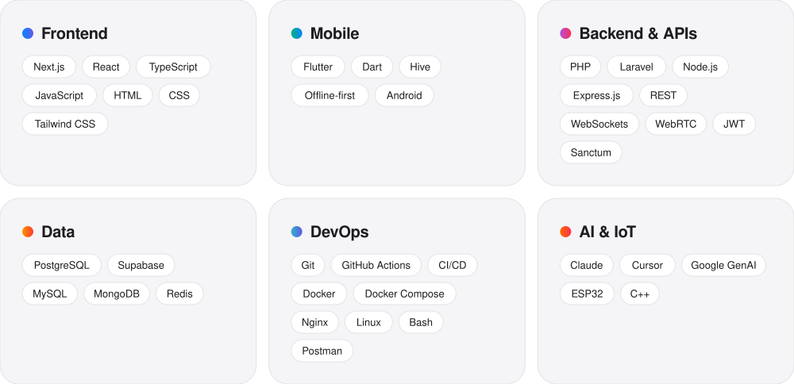</picture>

  

<picture><source media="(prefers-color-scheme: dark)" srcset="./assets/h-activity-dark.svg" /></picture>

  <picture>
    <source media="(prefers-color-scheme: dark)" srcset="https://github-readme-stats-alpha-ten-19.vercel.app/api?username=tyrelcruz&show_icons=true&hide_border=true&count_private=true&include_all_commits=true&border_radius=24&bg_color=161618&title_color=F5F5F7&text_color=A1A1A6&icon_color=2997FF" />
    
  </picture>
  <picture>
    <source media="(prefers-color-scheme: dark)" srcset="https://github-readme-stats-alpha-ten-19.vercel.app/api/top-langs/?username=tyrelcruz&hide_border=true&layout=compact&count_private=true&border_radius=24&bg_color=161618&title_color=F5F5F7&text_color=A1A1A6" />
    
  </picture>

  <picture>
    <source media="(prefers-color-scheme: dark)" srcset="https://streak-stats.vercel.app/?user=tyrelcruz&hide_border=true&border_radius=24&background=161618&ring=2997FF&fire=FF9F0A&currStreakLabel=F5F5F7&sideLabels=A1A1A6&currStreakNum=F5F5F7&sideNums=F5F5F7&dates=86868B&stroke=2C2C2E" />
    
  </picture>

 

<a href="mailto:tyrelcruz90@gmail.com">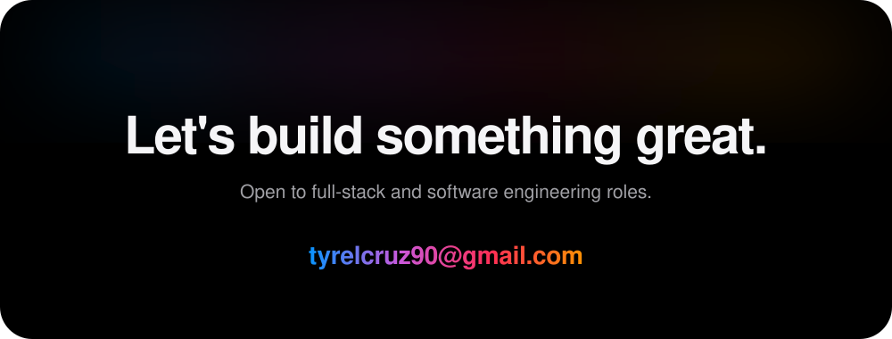</a>

  <a href="https://tyrelcruz.com"><picture><source media="(prefers-color-scheme: dark)" srcset="./assets/btn-portfolio-dark.svg" /></picture></a>&nbsp;
  <a href="https://linkedin.com/in/tyrelcruz"><picture><source media="(prefers-color-scheme: dark)" srcset="./assets/btn-linkedin-dark.svg" /></picture></a>&nbsp;
  <a href="mailto:tyrelcruz90@gmail.com"><picture><source media="(prefers-color-scheme: dark)" srcset="./assets/btn-email-dark.svg" /></picture></a>

